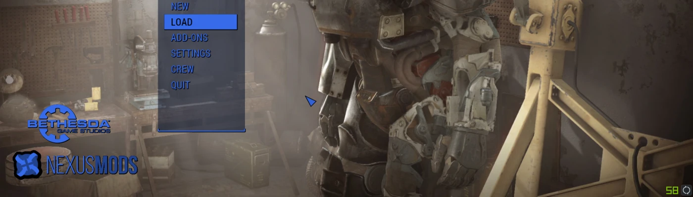

# Proper Credit (Nexus Mods Bethesda logo Replacer)

- [Nexus Mods](https://www.nexusmods.com/fallout4/mods/39606)

| Alternative | Version | Upload Date  | File |
|-|----------|--------------|------|
| Nexus Only | 1.0     | 21 Jun. 2019 | [Download](https://github.com/Starlight-Skull/game-mods/raw/refs/heads/main/Fallout%204/Proper%20Credit/Archive/Nexus%20BGS%20Logo%20Replacer%20v1.0.zip) |
| Both Horizontal | 2.0     | 28 Jun. 2019 | [Download](https://github.com/Starlight-Skull/game-mods/raw/refs/heads/main/Fallout%204/Proper%20Credit/Archive/BGS%20&%20Nexus%20(horizontal)%20v2.0.zip) |
| Both Vertical | 2.0     | 28 Jun. 2019 | [Download](https://github.com/Starlight-Skull/game-mods/raw/refs/heads/main/Fallout%204/Proper%20Credit/Archive/BGS%20&%20Nexus%20(vertical)%20v2.0.zi) |
| Nexus Only | 2.0     | 28 Jun. 2019 | [Download](https://github.com/Starlight-Skull/game-mods/raw/refs/heads/main/Fallout%204/Proper%20Credit/Archive/Nexus%20Only%20v2.0.zip) |

---

UPDATE: this mod now adds the Nexus Mods logo together with the Bethesda Game Studios logo with currently three options.

---

~~I can't be the only one that pretty much has more modded files than actual Bethesda assets, right?~~

**We all use the mods on this site extensively and our gaming experience wouldn't be the same without it.**

So I thought to myself: we should give the community some credit.

Which leads me to this:

 

## What it does

All this mod really does is change the Bethesda Game Studios shape in the *MainMenu.swf* file to one of the following:

- **Bethesda Game Studios and Nexus Mods (vertical)**: adds the Nexus logo below the Bethesda logo
- **Bethesda Game Studios and Nexus Mods (horizontal)**: same thing but placed to the right of Bethesda
- **Nexus Only**: simply replaces Bethesdas logo with the Nexus Mods logo

 

\*Also look at the images at the top. (tap down on your keyboard if it's not fully visible)

~~It even changes the colors to match your game menu! (Big deal, that happens automatically.)~~

 
 

### Compatibility

There shouldn't be any problems unless MainMenu.swf is changed. (Which is what this mod does.)

 

### Recommended Mods for the Main Menu **(not made by me)**

- **CC Cleaner**: Hides the Creation Club News pop-up for those of you that don't really use the Creation Club. https://www.nexusmods.com/fallout4/mods/26592

- **No Bethesda and S.P.E.C.I.A.L Intro**: Removes the Bethesda intro and the S.P.E.C.I.A.L. videos so that your game will start faster. https://www.nexusmods.com/fallout4/mods/361

- **Classic UI Sounds**: Changes the UI sounds to those of the previous games for that nostalgic feel. https://www.nexusmods.com/fallout4/mods/39018

- One of the many video and/or music replacers that I'm not gonna list because there are just too many.

 

### Alternatives to this mod **(again, not made by me)**

- **No Bethesda Logo In Main Menu**: Simply removes the Bethesda logo altogether. https://www.nexusmods.com/fallout4/mods/11979

- **Bethesda Logo Skins**: Same thing as this mod but changes it to "BUGTHESDA" or "GREEDTHE$DA" https://www.nexusmods.com/fallout4/mods/26524

 

### P.S.

It's a real ~~bitch~~ annoyance to find a program that can actually open .swf files, let alone edit and save them.

I used Sothink SWF Decompiler,
https://www.sothink.com/product/flashdecompiler/?gclid=Cj0KCQjwgLLoBRDyARIsACRAZe493bea2HtPMoGUjJKYLjZk8wSn7cyid3ltmY1y2mn1CMVY43HmPCoaAuRCEALw_wcB

and Bethesda Archive Extractor to actually get the file.
https://www.nexusmods.com/fallout4/mods/78

---

> 

> Vanilla
> 

> Bethesda and Nexus vertical
> 

> Bethesda and Nexus horizontal
> 

> Nexus Mods Only
> 
