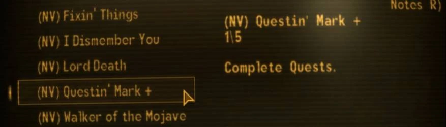

# Prefixer AKA Challenge Prefixes

- [Nexus Mods](https://www.nexusmods.com/newvegas/mods/69632)

| Alternative | Version | Upload Date  | File                                                                                                                                                               | Description                                                                                                                                                                                                             |
| ----------- | ------- | ------------ | ------------------------------------------------------------------------------------------------------------------------------------------------------------------ | ----------------------------------------------------------------------------------------------------------------------------------------------------------------------------------------------------------------------- |
| Normal      | 1.0     | 8 Aug. 2020  | [Download](https://github.com/Starlight-Skull/game-mods/raw/refs/heads/main/Fallout%20New%20Vegas/Prefixer/Archive/Challenge%20Prefixes%20v1.0.zip)                | Requires base game and DLC. Use only one version.                                                                                                                                                                       |
| TTW         | 1.0     | 8 Aug. 2020  | [Download](https://github.com/Starlight-Skull/game-mods/raw/refs/heads/main/Fallout%20New%20Vegas/Prefixer/Archive/Challenge%20Prefixes%20v1.0%20-%20TTW.zip)      | Requires Tale of Two Wastelands. Use only one version.                                                                                                                                                                  |
| Normal      | 1.1     | 5 Dec. 2020  | [Download](https://github.com/Starlight-Skull/game-mods/raw/refs/heads/main/Fallout%20New%20Vegas/Prefixer/Archive/Challenge%20Prefixes%20v1.1.zip)                | Requires base game and DLC. Use only one version.                                                                                                                                                                       |
| TTW         | 1.1     | 5 Dec. 2020  | [Download](https://github.com/Starlight-Skull/game-mods/raw/refs/heads/main/Fallout%20New%20Vegas/Prefixer/Archive/Challenge%20Prefixes%20v1.1%20-%20TTW.zip)      | Requires Tale of Two Wastelands. Use only one version.                                                                                                                                                                  |
| Scripted    | 2.0     | 14 Apr. 2022 | [Download](https://github.com/Starlight-Skull/game-mods/raw/refs/heads/main/Fallout%20New%20Vegas/Prefixer/Archive/Challenge%20Prefixes%20v2.0.zip)                | The new version uses a script and an ini file to dynamicaly rename challenges instead of manually renaming them. Requires JIP LN                                                                                        |
| Prefixer    | 2.1     | 8 Jun. 2022  | [Download](https://github.com/Starlight-Skull/game-mods/raw/refs/heads/main/Fallout%20New%20Vegas/Prefixer/Archive/Challenge%20Prefixes%20v2.1%20-%20Prefixer.zip) | Uses a script and an ini file to dynamicaly rename challenges with a prefix per plugin. If updating from version 2.0, copy the contents of the Challenges.ini to StarlightSkull/Prefixer.ini. Requires xNVSE and JIP LN |

## About This Mod

> *User Interfaces - Scripted Events - New Vegas Script Extender (NVSE) - JIP LN NVSE Plugin*

Prefixes the name of challenges, quests and others with the plugin they come from, similar to the (GRA) from Gun Runner's Arsenal.
Also suffixes a "+" for recurring challenges.
Fully configurable.

## Requirements

| Mod Name                                                                          | Notes |
| --------------------------------------------------------------------------------- | ----- |
| [JIP LN NVSE Plugin](https://www.nexusmods.com/newvegas/mods/58277)               |       |
| [New Vegas Script Extender (NVSE)](https://www.nexusmods.com/newvegas/mods/67883) |       |

## Description

### Update v2.1

Another update!
I cleaned up the script with newer functions, comments, unnecessary statements, etc...
Based on a suggestion to apply the script on quests the script has been reworked to work with all form types.
The recurring symbol can now also be set in the INI.
The INI itself has also been renamed and moved to /config/StarlightSkull/Prefixer.ini. If you had the old INI you can just copy everything under [Plugins].

### Update v2.0

So... after about a year and a half I finally got around to updating this.
Instead of manually renaming each challenge, the new version uses a script to prefix them based on which esp or esm they're from.
Prefixes come from the Challenges.ini file. If no entry for a plugin exists, an empty one is added which you can then add a name to.
The "+" suffix for recurring challenges is also scripted now.
The downside? is that it now requires [JIP LN](https://www.nexusmods.com/newvegas/mods/58277) but most people will probably have it already.

### Overview

This mod allows you to configure prefixes per plugin where something comes from similar to how Gun Runner's Arsenal does it.
Also similar to GRA's star "*" challenges it adds a "+" behind the name for recurring challenges.
Originally this was only for challenges but now it can affect any possible form type.
A full list of the possible types can be found on the [geckwiki](https://geckwiki.com/index.php?title=Form_Type_IDs).

~~A version for Tale of Two Wastelands is also available.~~

TTW adds all it's challenges in one plugin which means that the new script won't see the difference between Fallout 3 DLC.
If you prefer it the other way, the old versions are still functional.

### Compatibility

In theory this should work fine with all mods. In fact that was the point of the scripted version.
However mods that also rename things will work fine but for example sorting may work differently.

Tested and works alongside with [lStewieAl's Tweaks](https://www.nexusmods.com/newvegas/mods/66347)'s "bRecurringChallengeIndicator = 1"

## Images

## Changelog

- Version 2.1
  - Reworked script to apply to multiple form types.
  - Reworked script to use newer xNVSE functions.
  - Moved and updated INI contents
- Version 2.0
  - Wrote a script to replace the old file
- Version 1.1
  - Added TTW's GRA challenges to TTW version.
  - Added GRA challenges in case another mod changes them.
- Version 1.0
  - TTW version
  - Initial version
