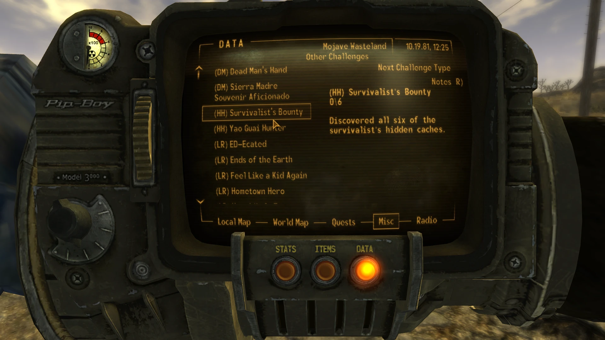

# Prefixer AKA Challenge Prefixes

- [Nexus Mods](https://www.nexusmods.com/newvegas/mods/69632)

| Alternative | Version | Upload Date  | File                                                                                                                                                               | Description                                                                                                                                                                                   |
| ----------- | ------- | ------------ | ------------------------------------------------------------------------------------------------------------------------------------------------------------------ | ----------------------------------------------------------------------------------------------------------------------------------------------------------------------------------------------|
| Normal      | 1.0     | 8 Aug. 2020  | [Download](https://github.com/Starlight-Skull/game-mods/raw/refs/heads/main/Fallout%20New%20Vegas/Prefixer/Archive/Challenge%20Prefixes%20v1.0.zip)                | Requires base game and DLC. Use only one version.                                                                                                                                             |
| TTW         | 1.0     | 8 Aug. 2020  | [Download](https://github.com/Starlight-Skull/game-mods/raw/refs/heads/main/Fallout%20New%20Vegas/Prefixer/Archive/Challenge%20Prefixes%20v1.0%20-%20TTW.zip)      | Requires Tale of Two Wastelands. Use only one version.                                                                                                                                        |
| Normal      | 1.1     | 5 Dec. 2020  | [Download](https://github.com/Starlight-Skull/game-mods/raw/refs/heads/main/Fallout%20New%20Vegas/Prefixer/Archive/Challenge%20Prefixes%20v1.1.zip)                | Requires base game and DLC. Use only one version.                                                                                                                                             |
| TTW         | 1.1     | 5 Dec. 2020  | [Download](https://github.com/Starlight-Skull/game-mods/raw/refs/heads/main/Fallout%20New%20Vegas/Prefixer/Archive/Challenge%20Prefixes%20v1.1%20-%20TTW.zip)      | Requires Tale of Two Wastelands. Use only one version.                                                                                                                                        |
| Scripted    | 2.0     | 14 Apr. 2022 | [Download](https://github.com/Starlight-Skull/game-mods/raw/refs/heads/main/Fallout%20New%20Vegas/Prefixer/Archive/Challenge%20Prefixes%20v2.0.zip)                | The new version uses a script and an ini file to dynamicaly rename challenges instead of manually renaming them. Requires JIP LN                                                              |
| Prefixer    | 2.1     | 8 Jun. 2022  | [Download](https://github.com/Starlight-Skull/game-mods/raw/refs/heads/main/Fallout%20New%20Vegas/Prefixer/Archive/Challenge%20Prefixes%20v2.1%20-%20Prefixer.zip) | Uses a script and an ini file to dynamicaly rename challenges with a prefix per plugin. If updating from version 2.0, copy the contents of the Challenges.ini to StarlightSkull/Prefixer.ini. |
| ESP-less    | 2.1     | 27 Jul. 2025 | [Download](https://github.com/Starlight-Skull/game-mods/raw/refs/heads/main/Fallout%20New%20Vegas/Prefixer/Archive/Prefixer%20v3.0%20-%20ESP-less.zip)             | Config file from v2.0 should still be compatible                                                                                                                                              |

## About This Mod

> *User Interfaces - Scripted Events - New Vegas Script Extender (NVSE) - JIP LN NVSE Plugin*

Prefixes the name of challenges, quests and anything else with the plugin they come from, similar to the (GRA) from Gun Runner's Arsenal.
Also suffixes a "+" for recurring challenges.
Fully configurable.

## Requirements

| Mod Name                                                                          | Notes |
| --------------------------------------------------------------------------------- | ----- |
| [JIP LN NVSE Plugin](https://www.nexusmods.com/newvegas/mods/58277)               |       |
| [New Vegas Script Extender (NVSE)](https://www.nexusmods.com/newvegas/mods/67883) |       |
| [ShowOff xNVSE Plugin](https://www.nexusmods.com/newvegas/mods/72541)             |       |

## Description

### Update v3.0: Now ESP-less

The script has been reworked and is now ESP-less. The basic functionality remains the same as in v2.0 but with the added option to automatically remove (GRA) tags. This makes it possible to change the prefix of those challenges without getting double tags.

### Overview

This mod allows you to configure a prefix per plugin. (.esp or .esm) These prefixes will be applied to your configured FormTypes. This only includes challenges by default but can be applied to pretty much anything. A full list of the possible types can be found on [the geckwiki](https://geckwiki.com/index.php?title=Form_Type_IDs).

The original idea was to replicate what Gun Runner's Arsenal does to it's challenges. The mod has since then grown into a tool that can help you find out from what mod a certain thing comes from. This can be useful for example when you have a large amount of quest mods and you can't tell what mod added which quest.

Also similar to GRA's star '***' challenges it adds a '+' behind the name of recurring challenges.

#### Usage

- Launch the game once with your favorite mods to generate the config file.
- Go to 'Data/Config/StarlightSkull/Prefixer.ini' and add prefixes to your liking.
- Only plugins with the configured FormTypes will be added to the list. If you change the FormTypes, just launch the game again.
- Leave the line blank to ignore a certain plugin.

#### Compatibility

In theory this should work fine with all mods. In fact that was the point of the scripted version.
Take care however with other mods that automatically rename things. For example [Real Weapon Names](https://www.nexusmods.com/newvegas/mods/79396) has to run it's script before this one in case of weapons.

As far as I can tell ESP-less / script runner mods are loaded alphabetically. The script is called xPrefixer so that it runs after most others but can still be overwriten.

Tested and works alongside with [lStewieAl's Tweaks's](https://www.nexusmods.com/newvegas/mods/66347) "bRecurringChallengeIndicator = 1"

## Images

> 
>
> 
>
> '+' for recurring challenges 
>
> 
>
> Example with questlog 
>
> With Stewie Tweaks enabled 

## Changelog

- Version 3.0
  - Rewritten for Script Runner
  - Added option to remove GRA tags from challenges
- Version 2.1
  - Reworked script to apply to multiple form types.
  - Reworked script to use newer xNVSE functions.
  - Moved and updated INI contents
- Version 2.0
  - Wrote a script to replace the old file
- Version 1.1
  - Added TTW's GRA challenges to TTW version.
  - Added GRA challenges in case another mod changes them.
- Version 1.0
  - TTW version
  - Initial version
