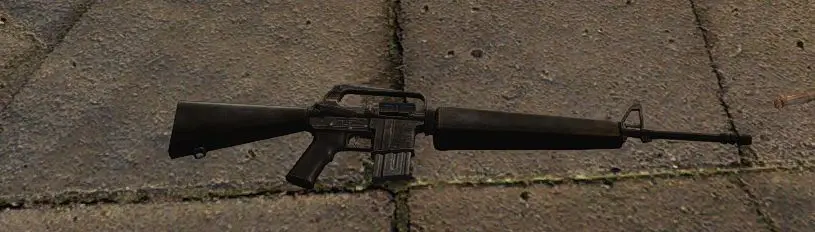
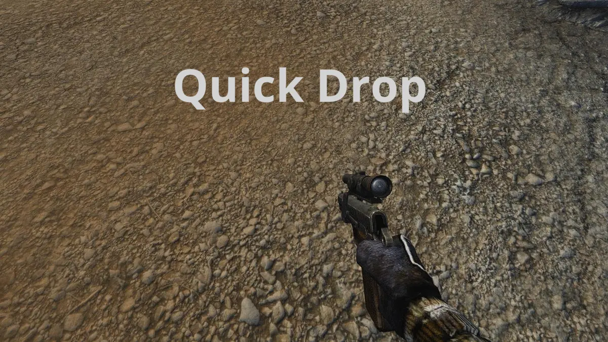
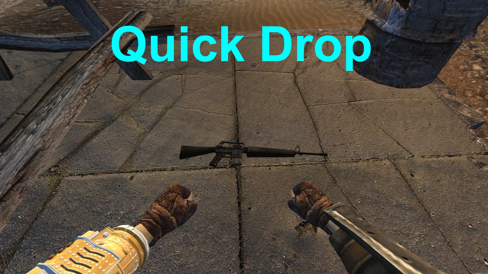
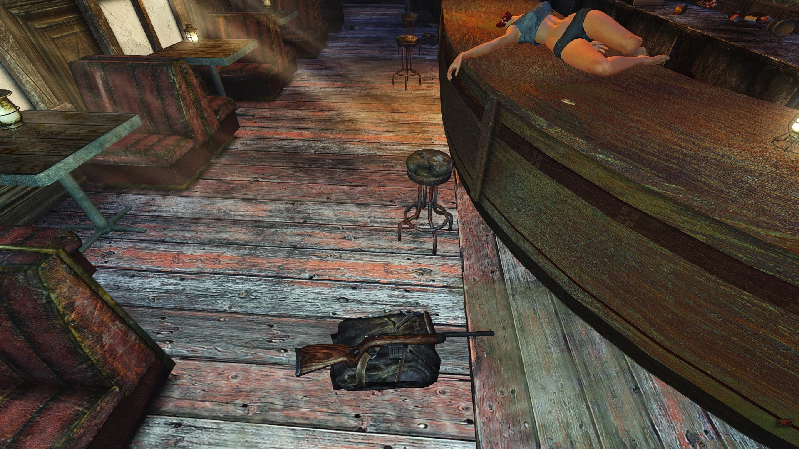
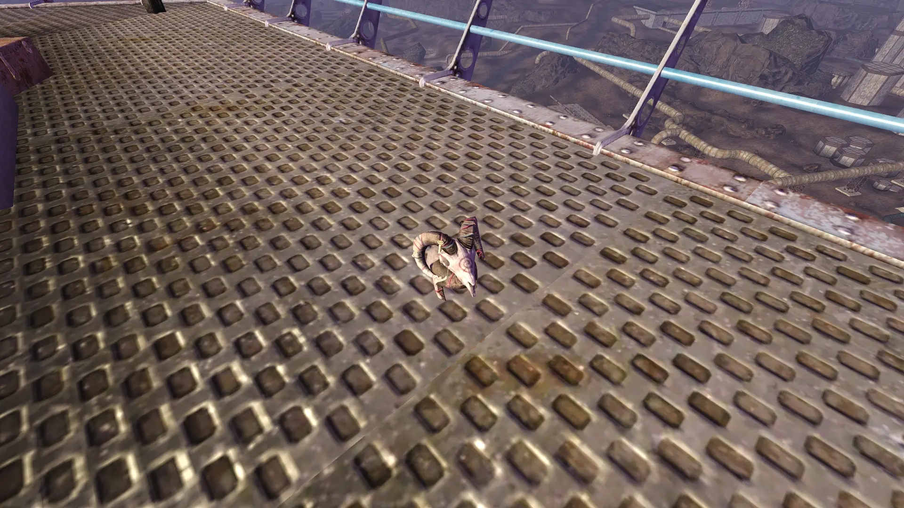
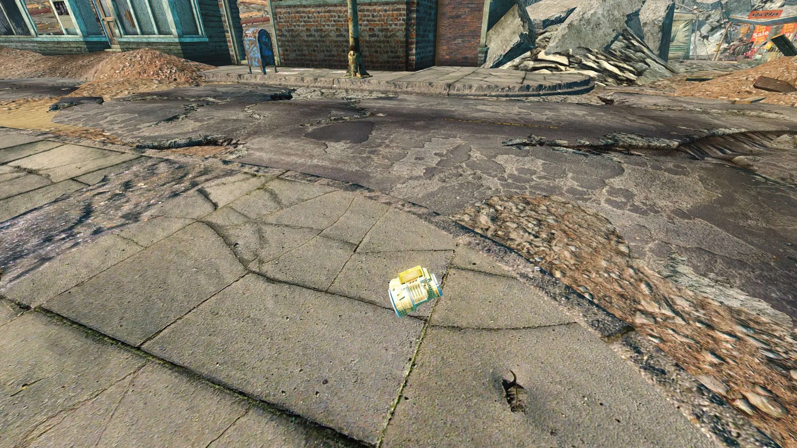
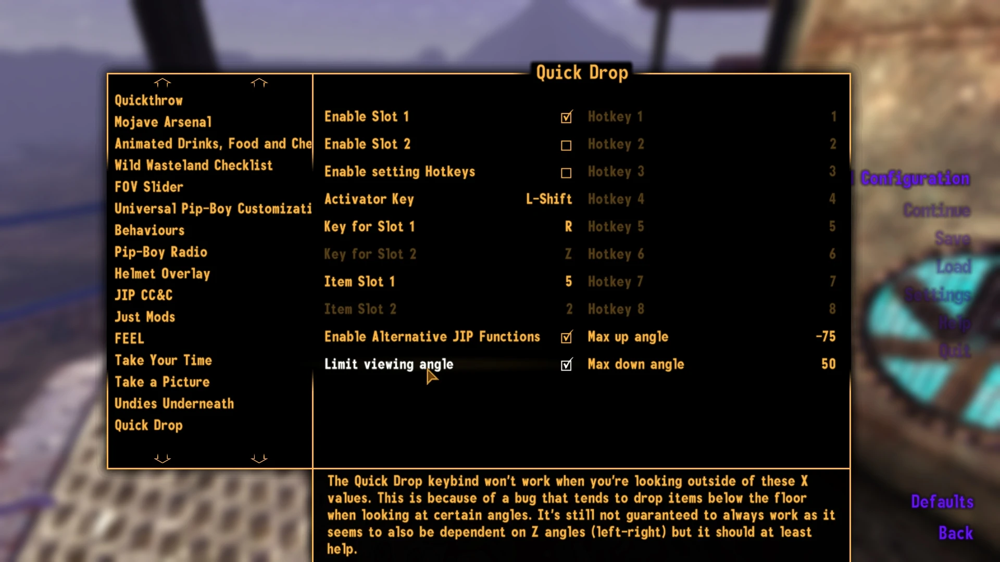
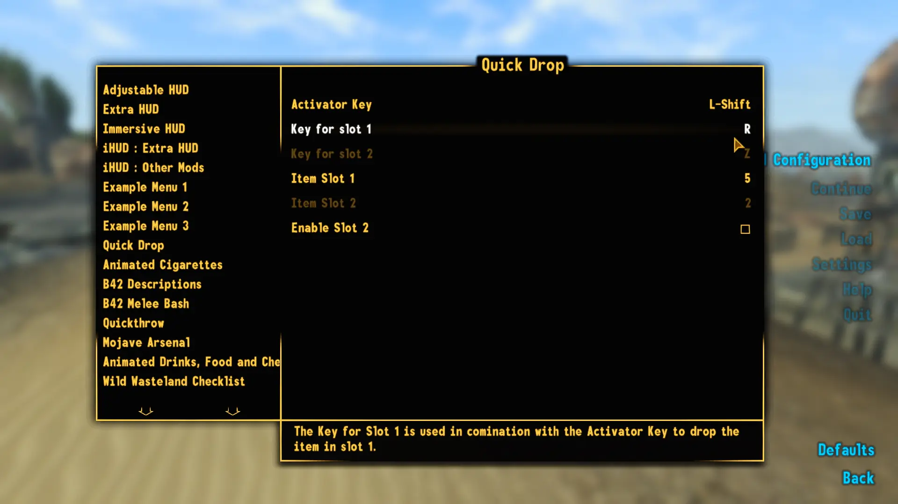

# Quick Drop

- [Nexus Mods](https://www.nexusmods.com/newvegas/mods/70597)

| Version | Upload Date  | File                                                                                                                                            | Description                                                                                          |
| ------- | ------------ | ----------------------------------------------------------------------------------------------------------------------------------------------- | ---------------------------------------------------------------------------------------------------- |
| 1.0     | 11 Dec. 2020 | [Download](https://github.com/Starlight-Skull/game-mods/raw/refs/heads/main/Fallout%20New%20Vegas/Quick%20Drop/Archive/Quick%20Drop%20v1.0.zip) |                                                                                                      |
| 2.0     | 22 Dec. 2020 | [Download](https://github.com/Starlight-Skull/game-mods/raw/refs/heads/main/Fallout%20New%20Vegas/Quick%20Drop/Archive/Quick%20Drop%20v2.0.zip) | Added a second slot and MCM options to change keybinds and which equipped item is dropped.           |
| 3.0     | 23 Dec. 2020 | [Download](https://github.com/Starlight-Skull/game-mods/raw/refs/heads/main/Fallout%20New%20Vegas/Quick%20Drop/Archive/Quick%20Drop%20v3.0.zip) | Added some new options and potential fixes aswell as the ability to set your hotkeys during Gamemode |

## About This Mod

> *Gameplay Effects and Changes - Scripted Events - New Vegas Script Extender (NVSE) - Mod Configuration Menu (MCM) - JIP LN NVSE Plugin*



Quickly drop your weapon or armor with SHIFT + R or SHIFT + Z. No menus needed!
Mostly intended for players with Quick Use mods.

Now also with MCM support.
Now can also set hotkeys outside of menus.

## Requirements

| Mod Name                                                                          | Notes                 |
| --------------------------------------------------------------------------------- | --------------------- |
| [JIP LN NVSE Plugin](https://www.nexusmods.com/newvegas/mods/58277)               | For an optional fix   |
| [New Vegas Script Extender (NVSE)](https://www.nexusmods.com/newvegas/mods/67883) |                       |
| [The Mod Configuration Menu](https://www.nexusmods.com/newvegas/mods/42507)       | For optional settings |

## Description

I've been playing with a quick use mod for quite a while now and I really like it because opening the pip-boy every time you find something new and equip it there slows down the game, etc...

Thing is, if you pick up a random gun and run out of ammo, you still have to open the menu and drop it.

<br/>

### So here's my solution:

If you press  *SHIFT + R*  at any time when not in a menu (Gamemode not Menumode), you will simply drop whatever you have currently equipped in your weapon slot.

Update: Added a second keybinding *SHIFT + Z* to drop equipped armor along with some options in the [MCM](https://www.nexusmods.com/newvegas/mods/42507) to change the keys and the type of item that is dropped. (see screenshots)

```txt
Item Slots
0      Head
1      Hair
2      Upper Body
3      Left Hand
4      Right Hand
5      Weapon
6      Pip-Boy
7      Backpack
8      Necklace
9      Headband
10    Hat
11    Eye Glasses
12    Nose Ring
13    Earrings
14    Mask
15    Choker
16    Mouth Object
17    Body Addon 1
18    Body Addon 2
19    Body Addon 3
```

You should really only use 2, 5, 9, 10, 11 and 14 as the others usually aren't meant to be dropped. There are plenty of mods that add items for those other slots and that's why they're here but just keep in mind that not everything has a world model.

Update: Added an option to set hotkeys with *SHIFT + 1-8*. This should probably be a separate mod but it's so small I'd rather include it here.
You can also change the key for the hotkeys in case you're using a different setup.

Also added an option to use JIP LN's "DropAlt" instead of "Drop" is JIP LN is loaded. Supposedly this is an improved version of drop but I haven't really seen any difference.

### To Do:

- fix problems in the problems section
- ~~set up some options for the MCM such as:~~
  - ~~change key binds~~
  - ~~change the type of item dropped~~
- maybe add a video or something idk
- do something useful with my life

<br/>

### Problems:

- dropping while looking directly up or down tends to drop it below the floor (usually still accessible with "tcl")
  - *potential fix in 3.0*
- items are dropped regardless of quest item status
  - *forgot to make a setting for this, I'll patch it later*
- throwables are unpredictable in how many they drop (weapons drop only one though)
  - *I don't think I can fix this*
- not all items have proper world models so for example dropping your Pip-Boy would be a bad idea
  - *I can't fix this*
- there might be others

<br/>

### Compatibility:

As this is a simple scripting mod, it shouldn't conflict with anything however it does use some functions of the script extender so you'll probably need that.

Technically you don't need the [MCM](https://www.nexusmods.com/newvegas/mods/42507) but without you will only have access to what was in 1.0 as the second key is disabled by default and you won't be able to change any keys or slots. (I suppose you could change stuff with commands but why bother...)

There's an option to use a function from [JIP LN NVSE](https://www.nexusmods.com/newvegas/mods/58277). It's not essential though, so you don't have to install it just for this mod but it's nice to have if you already have it.

[Here](https://www.nexusmods.com/newvegas/mods/66347) and [here](https://www.nexusmods.com/newvegas/mods/66486) are some good quick use mods if you want one.

<br/>

### Some interesting situations I found while testing:

- dropping while sprinting ([mod](https://www.nexusmods.com/newvegas/mods/66666)) or doing a power attack tends to send your weapon flying
- dropping while aiming or blocking keeps the weapon holding animation so you can point finger guns at people (punching or switching cancels it)
- it seems to work during pretty much any animation like sitting, swimming, jumping, ...
- the dropping below the floor bug seems to depend on the angle the player is looking at, I've made an option to only trigger the script when looking between certain X angles but it's not perfect

<br/>

That's all for now. Feel free to tell me about any bugs or features (or bugs that should be features) that you find!

---

> Flashy new thumbnail 
>
> Old thumbnail 
>
> Drop your armor too - (Don't worry about Sunny) 
>
> Drop your helmet too 
>
> Don't drop your Pip-Boy - Seriously, don't 
>
> New MCM options in V3 
>
> MCM options - (Fixed typo in the release) 

## Changelog

- Version 3.0
  - Added MCM options for all of these
  - Added option to set hotkeys with SHIFT + 1-8
  - Added option to use JIP LN's "DropAlt" instead
  - Added potential fix to the dropping below ground bug (limits the viewing angle at which it can be activated)
- Version 2.0
  - Added scripts as miscellaneous file.
  - Added MCM support with options to change keybinds and item slots.
  - Added second keybind to drop armor. - Default SHIFT + Z
- Version 1.0
  - Initial version
