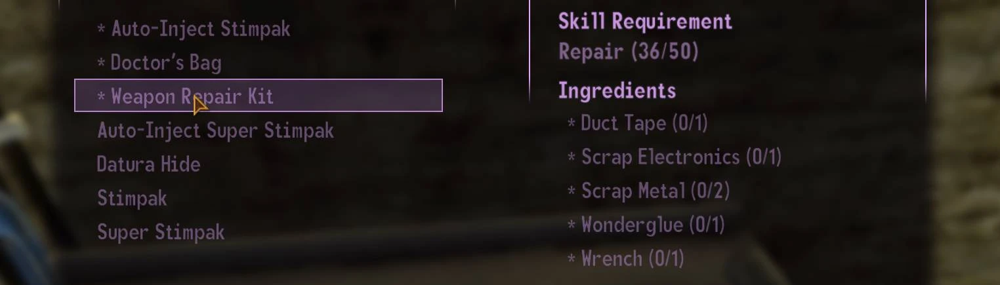
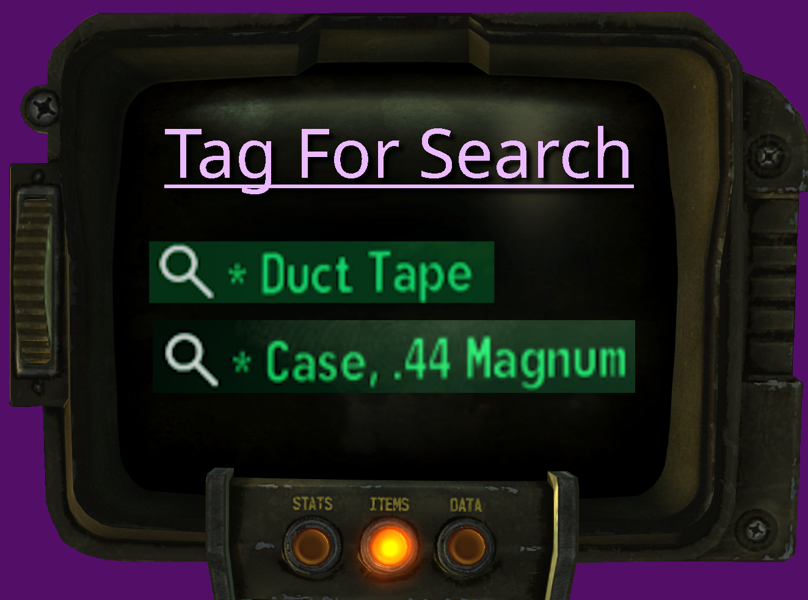
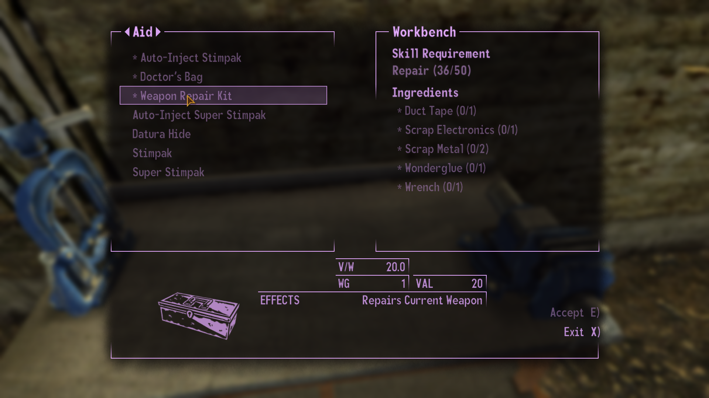
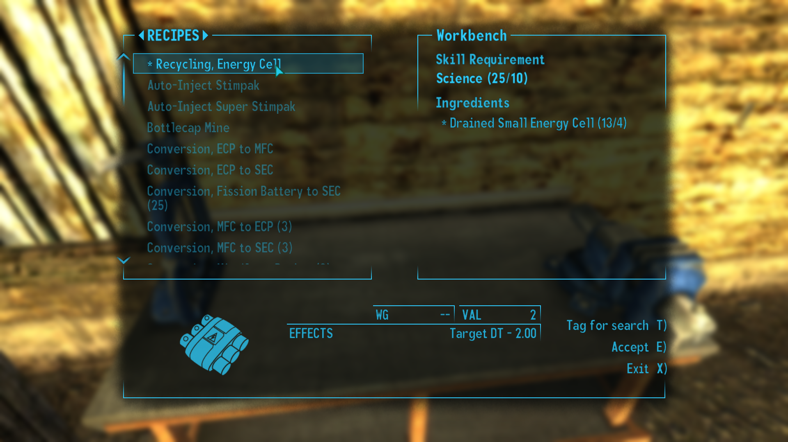
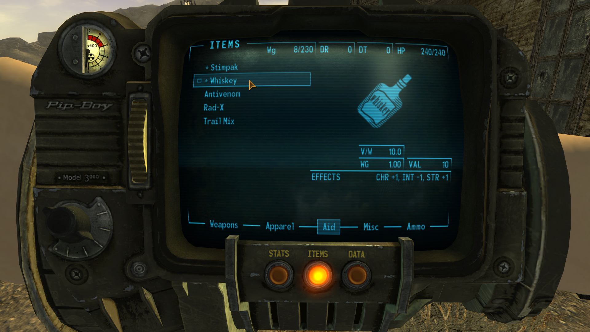
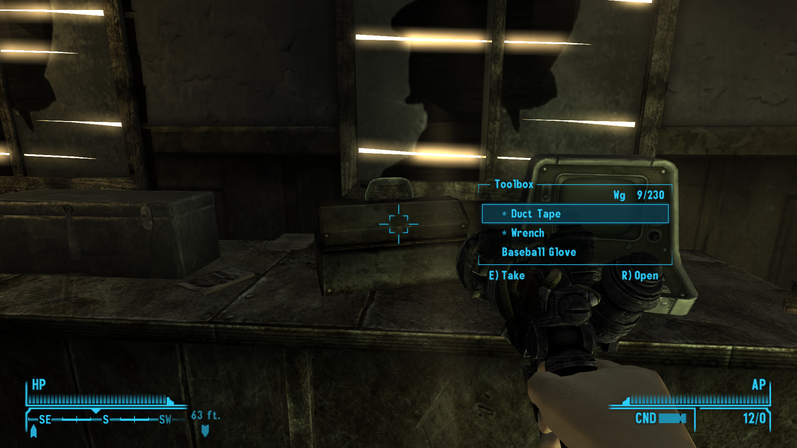
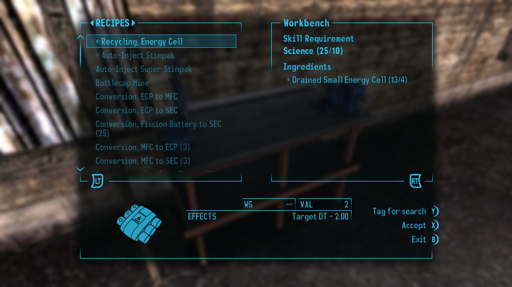
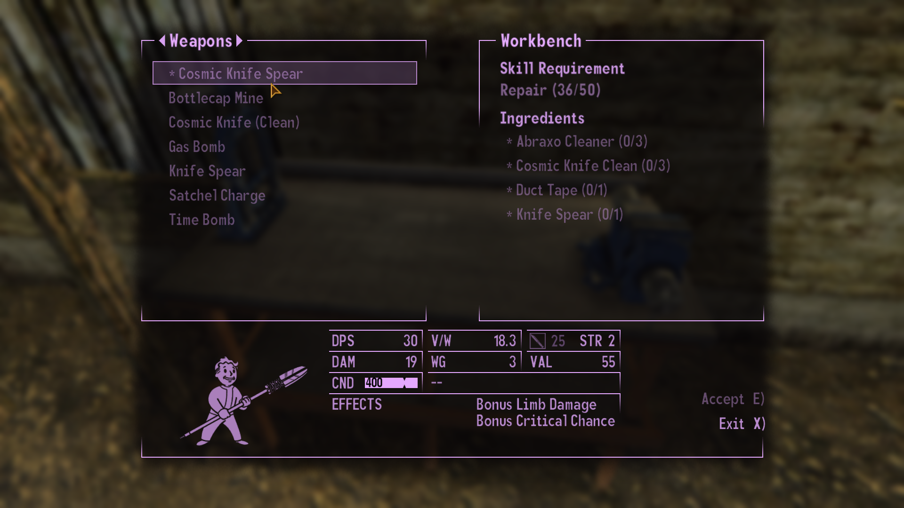
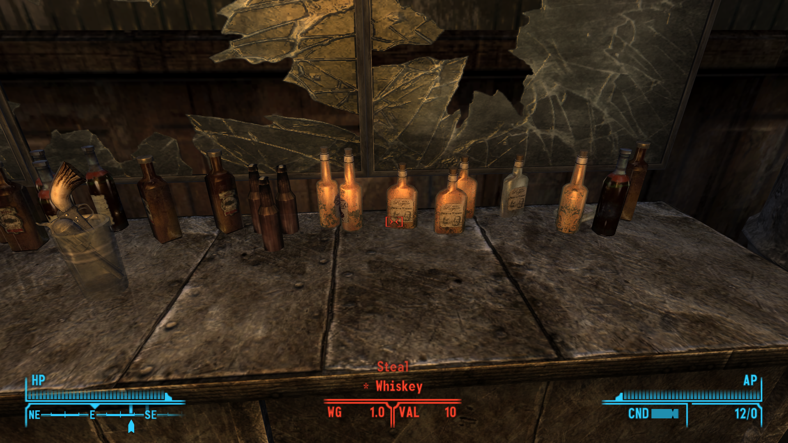
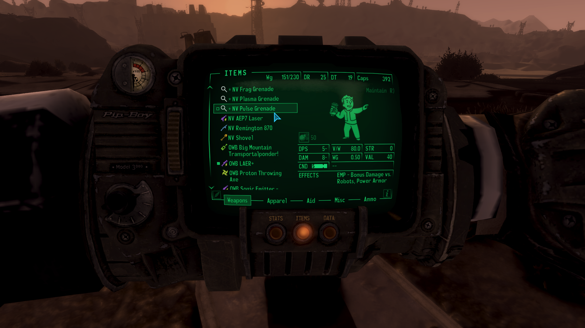

# Tag For Search

- [Nexus Mods](https://www.nexusmods.com/newvegas/mods/93094)

| Version | Upload Date  | File                                                                                                                                                          | Description                                    |
| ------- | ------------ | ------------------------------------------------------------------------------------------------------------------------------------------------------------- | ---------------------------------------------- |
| 1.0     | 27 Jul. 2025 | [Download](https://github.com/Starlight-Skull/game-mods/raw/refs/heads/main/Fallout%20New%20Vegas/Tag%20For%20Search/Archive/Tag%20For%20Search%20v1.0.zip)   | ESP-less, INI will be generated at first load. |
| 1.1     | 28 Jul. 2025 | [Download](https://github.com/Starlight-Skull/game-mods/raw/refs/heads/main/Fallout%20New%20Vegas/Tag%20For%20Search/Archive/Tag%20For%20Search%20v1.1.zip)   | Now with controller support, hold Y.           |
| 1.2     | 28 Jul. 2025 | [Download](https://github.com/Starlight-Skull/game-mods/raw/refs/heads/main/Fallout%20New%20Vegas/Tag%20For%20Search/Archive/Tag%20For%20Search%20v1.2.zip)   | Hotfix for console spam.                       |
| 2.0     | 31 Jul. 2025 | [Download](https://github.com/Starlight-Skull/game-mods/raw/refs/heads/main/Fallout%20New%20Vegas/Tag%20For%20Search/Archive/Tag%20For%20Search%20v2.0.zip)   | Now with optional yUI Sorting Icons support.   |
| 2.1     | 10 Aug. 2025 | [Download](https://github.com/Starlight-Skull/game-mods/raw/refs/heads/main/Fallout%20New%20Vegas/Tag%20For%20Search/Archive/Tag%20For%20Search%20v2.1.zip)   | FOMOD installer.                               |
| 2.1.1   |  3 Sep. 2025 | [Download](https://github.com/Starlight-Skull/game-mods/raw/refs/heads/main/Fallout%20New%20Vegas/Tag%20For%20Search/Archive/Tag%20For%20Search%20v2.1.1.zip) | Added missing FOMOD parts for Vortex.           |

## About This Mod

> *User Interface - New Vegas Script Extender (NVSE) - JIP LN NVSE Plugin - Quality of Life - User Interface Organizer (UIO)*

A small ESP-less utility that lets you tag crafting recipes and materials so you can find them easier in the world or in your storage.

## Requirements

| Mod Name                                                      | Notes                        |
| --------------------------------------------------------------| ---------------------------- |
| [xNVSE](https://www.nexusmods.com/newvegas/mods/67883)        |                              |
| [JIP LN](https://www.nexusmods.com/newvegas/mods/58277)       |                              |
| [JohnnyGuitar](https://www.nexusmods.com/newvegas/mods/66927) |                              |
| [UIO](https://www.nexusmods.com/newvegas/mods/57174)          | Only for the ui label option |
| [yUI](https://www.nexusmods.com/newvegas/mods/74357)          | Only for the ySI option      |
| [ySI](https://www.nexusmods.com/newvegas/mods/74358)          | Only for the ySI option      |

## Description

### Overview

Do you ever find yourself trying to craft something and forgetting the recipe? Have you ever wondered if it was Scrap Metal or Scrap Electronics that you were missing for that one recipe?

Well, wonder no longer! Inspired by Fallout 4's "Tag For Search" feature, this mod lets you tag recipe ingredients or individual items so you can find them easier in the world or in your storage containers.

Press 'T' or 'Y' on a controller to tag or untag recipes in a workbench. You can also tag or untag individual items from the Pip-Boy inventory or from containers.

This will simply add a '*' to the name and save the EditorId to an INI file. This list will also be applied on startup so your tags are saved but your save file stays clean. If you use yUI Sorting Icons, you can choose to install the ySI version that will also add a new icon to tagged items.

#### Update v2.1: Fixed ySI Support and more options

v2.1 comes with a FOMOD installer with a few options. Selecting none for ySI support here will bring back the vanilla mode that should work properly again.

The installer also comes with an choice between setting the icon to the Pip-Boy UI color or plain white. (Intended for [Colorful Inventory Ycons](https://www.nexusmods.com/newvegas/mods/78674) and [Colorful Icons Support](https://www.nexusmods.com/newvegas/mods/85075))

I also added an option to run the start script on save load instead of game launch. This may cause a little more overhead but should be more compatible with other mods that rename things at save load.

The default controller delay is now set to 0 seconds, effectively remove the need to hold the button. I feel like it was an unnecessary delay. Existing configs will be unaffected.

Finally there is also an option to add a hint label "Tag For Search" to the recipe and container menus. This not a functional button.

#### Config

The config file will be automatically generated at *"Data/Config/StarlightSkull/TagForSearch.ini"* the first time this mod is loaded.

Here you can change the hotkey to another key or gamepad button if you want, see [this list](https://geckwiki.com/index.php?title=DirectX_Scancodes) for keyboard IDs and [here](https://geckwiki.com/index.php?title=IsButtonPressed#XBox_Controller_Button_Codes) for a list of gamepad IDs. You will have to manually update the menu files if you have install the label and change the keycodes. (*"Data/Menus/Prefabs/TagForSearch/"*)

If needed, you can manually change the list too. Entries from uninstalled plugins will be considered invalid and will be ignored.

## Images

> 
>
> 
>
> 
>
> 
>
> Custom Ycon 
>
> Controller support 
>
> JAM - Loot menu 
>
> 
>
> 
>
> 

## Changelogs

- Version 2.1
  - Added FOMOD installer
  - Added option for colored ySI icon
  - Added options for ui label
  - Added option to start script at save load instead of game launch
  - Fixed vanilla support
- Version 2.0
  - Added ySI support
  - Added custom Ycon
  - Fixed a bug that prevented tag changes in the inventory from saving to the INI
  - Rewrote the entire script
  - Moved recipes to their own INI section (automatic)
- Version 1.2
  - Fixed an error when pressing the hotkey with the console open.
- Version 1.1
  - Add controller support, Default is hold Y for 0.5 seconds.
