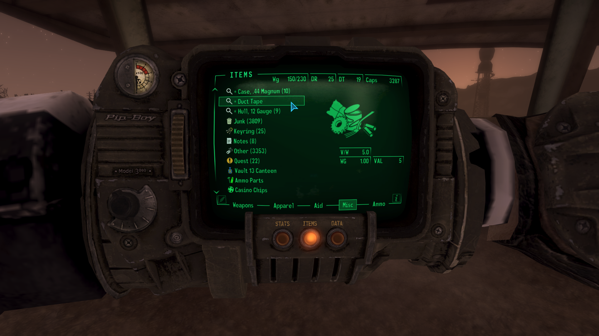

# Tag For Search

- [Nexus Mods](https://www.nexusmods.com/newvegas/mods/93094)

| Version | Upload Date  | File                                                                                                                                                               | Description                                    |
| ------- | ------------ | ------------------------------------------------------------------------------------------------------------------------------------------------------------------ | -----------------------------------------------|
| 1.0     | 27 Jul. 2025 | [Download](https://github.com/Starlight-Skull/game-mods/raw/refs/heads/main/Fallout%20New%20Vegas/Tag%20For%20Search/Archive/Tag%20For%20Search%20v1.0.zip)       | ESP-less, INI will be generated at first load. |
| 1.1     | 28 Jul. 2025 | [Download](https://github.com/Starlight-Skull/game-mods/raw/refs/heads/main/Fallout%20New%20Vegas/Tag%20For%20Search/Archive/Tag%20For%20Search%20v1.1.zip)       | Now with controller support, hold Y.           |
| 1.2     | 28 Jul. 2025 | [Download](https://github.com/Starlight-Skull/game-mods/raw/refs/heads/main/Fallout%20New%20Vegas/Tag%20For%20Search/Archive/Tag%20For%20Search%20v1.2.zip)       | Hotfix for console spam.                       |
| 2.0     | 31 Jul. 2025 | [Download](https://github.com/Starlight-Skull/game-mods/raw/refs/heads/main/Fallout%20New%20Vegas/Tag%20For%20Search/Archive/Tag%20For%20Search%20v2.0.zip)       | Now with optional yUI Sorting Icons support.   |

## About This Mod

> *User Interfaces - Scripted Events - New Vegas Script Extender (NVSE) - JIP LN NVSE Plugin - Quality of Life*

A small ESP-less utility that lets you tag crafting recipes and materials so you can find them easier in the world or in your storage.

## Requirements

| Mod Name                                                             | Notes                     |
| ---------------------------------------------------------------------| ------------------------- |
| [JIP LN NVSE Plugin](https://www.nexusmods.com/newvegas/mods/58277)  |                           |
| [JohnnyGuitar NVSE](https://www.nexusmods.com/newvegas/mods/66927)   |                           |
| [ySI - Sorting Ycons](https://www.nexusmods.com/newvegas/mods/74358) | Optional but recommended. |

## Description

### Overview

Do you ever find yourself trying to craft something and forgetting the recipe? Have you ever wondered if it was Scrap Metal or Scrap Electronics that you were missing for that one recipe?

Well, wonder no longer! Inspired by Fallout 4's "Tag For Search" feature, this mod lets you tag recipe ingredients or individual items so you can find them easier in the world or in your storage containers.

Press 'T' or hold 'Y' on a controller to tag or untag recipes in a workbench. You can also tag or untag individual items from the Pip-Boy inventory or from containers.

This will simply add a '*' to the name and save the EditorId to an INI file. This list will also be applied on startup so your tags are saved but your save file stays clean.

#### Update v2.0: yUI Sorting Icons Support

The script will automatically detect if you have [yUI Sorting Icons](https://www.nexusmods.com/newvegas/mods/74358) installed and enable ySI mode.

In this mode, tagged items will get a custom icon to help with sorting. (You may have to re-tag items that were saved without yUI mode.)

Tagged items will now also move outside of any categories you may have installed and into the top level. When untagged, the original icon and category will be restored.

#### Config

The config file will be automatically generated at *"Data/Config/StarlightSkull/TagForSearch.ini"* the first time this mod is loaded.

Here you can change the hotkey to another key or gamepad button if you want, see [this list](https://geckwiki.com/index.php?title=DirectX_Scancodes) for keyboard IDs and [here](https://geckwiki.com/index.php?title=IsButtonPressed#XBox_Controller_Button_Codes) for a list of gamepad IDs.

If needed, you can manually change the list too. Entries from uninstalled plugins will be considered invalid and will be ignored.

## Images

> 
>
> 
>
> 
>
> 
>
> 
>
> 
>
> 

## Changelogs

- Version 2.0
  - Added ySI support
  - Added custom Ycon
  - Fixed a bug that prevented tag changes in the inventory from saving to the INI
  - Rewrote the entire script
  - Moved recipes to their own INI section (automatic)
- Version 1.2
  - Fixed an error when pressing the hotkey with the console open.
- Version 1.1
  - Add controller support, Default is hold Y for 0.5 seconds.

