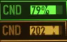
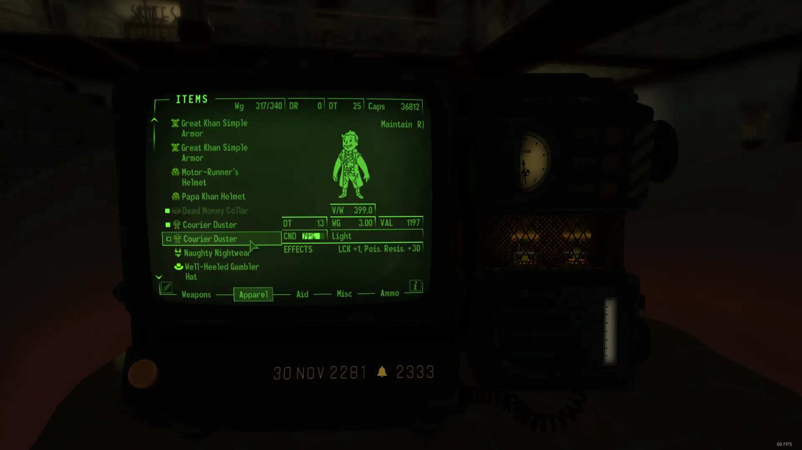

# True Condition

- [Nexus Mods](https://www.nexusmods.com/newvegas/mods/78796)

| Alternative  | Version | Upload Date  | File                                                                                                                                                                         | Notes                                                                                                                            |
| ------------ | ------- | ------------ | ---------------------------------------------------------------------------------------------------------------------------------------------------------------------------- | -------------------------------------------------------------------------------------------------------------------------------- |
|              | 1.0     | 28 Oct. 2022 | [Download](https://github.com/Starlight-Skull/game-mods/raw/refs/heads/main/Fallout%20New%20Vegas/True%20Condition/Archive/True%20Condition%20v1.0.zip)                      | Shows the actual condition/health of a weapon or armor. VUI+ and UIO required.                                                   |
| Percentage   | 1.0     | 28 Oct. 2022 | [Download](https://github.com/Starlight-Skull/game-mods/raw/refs/heads/main/Fallout%20New%20Vegas/True%20Condition/Archive/True%20Condition%20v1.0%20-%20Percentage.zip)     | Alternative file with a percentage instead of the true value. VUI+ and UIO are still required.                                   |
| Vanilla Safe | 1.0     | 28 Oct. 2022 | [Download](https://github.com/Starlight-Skull/game-mods/raw/refs/heads/main/Fallout%20New%20Vegas/True%20Condition/Archive/True%20Condition%20v1.0%20-%20Vanilla%20Safe.zip) | This is the same as the percentage version but optimized to use without VUI+. Tested and works on DarnUI. UIO is still required. |

## About This Mod

> *User Interfaces - User Interface Organizer (UIO) - Quality of Life*

A small UI mod that shows the true value of your armor and weapons condition. Now with alternative percentage version.

## Requirements

| Mod Name                                                                                          | Notes |
| ------------------------------------------------------------------------------------------------- | ----- |
| [UIO - User Interface Organizer](https://www.nexusmods.com/newvegas/mods/57174)                   |       |
| [Vanilla UI Plus (VUI+)](https://www.moddb.com/mods/vanilla-ui-plus/downloads/vanilla-ui-plus-nv) |       |

## Description

*Thanks for getting this mod on the front page of the New Vegas nexus, even if it was only for a while.*

This is just a small edit to show an item's numeric condition value on top of the CND bar.

There is also an optional file that shows a percentage instead.

 

UIO is a hard requirement which means this should be compatible with any other UI mods you have.

VUI+ is also required for the main and percentage versions.

 

A vanilla safe version exists in case you don't want to use VUI+.

Thanks to [KaptainCnucklz](https://www.nexusmods.com/newvegas/users/8327931) this has been tested with DarnUI. (See user images.)

 

### Some technical info:

I mainly use VUI+ but I know that there are many alternatives out there, while I can't guarantee compatibility, in theory the vanilla safe version should work if the mod doesn't change how the condition bar is displayed. VUI+ does change this which is why there is a different version.

Another thing is that by default the game gives a value between 0.0 and 1.0 to the UI file, VUI+ also gives the actual value via its plugin to support an optional feature to scale the length of the bar. This is why I can only show this value with that mod and only in that part of the UI.

This functionality would be possible without that plugin by making my own plugin but at the moment I have no plans to do so.

As for showing the condition on the main HUD, I did initially try this but the structure of that file is a lot more complex and I didn't find the where the condition bar is defined. I might try again in the future.

## Images

> 
>
> Note that this mod only changes the text over the CND bar 
>
> Alternative version with percent instead 
>
> Vanilla version without VUI+ 
>
> Also on container menu 
