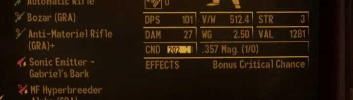
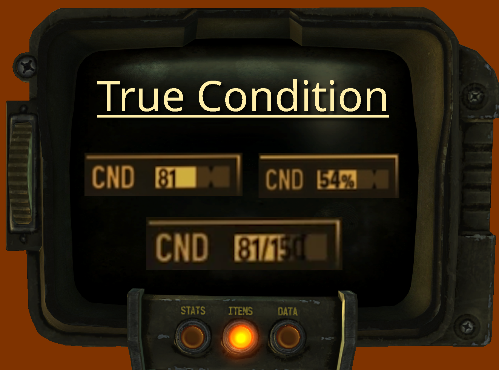
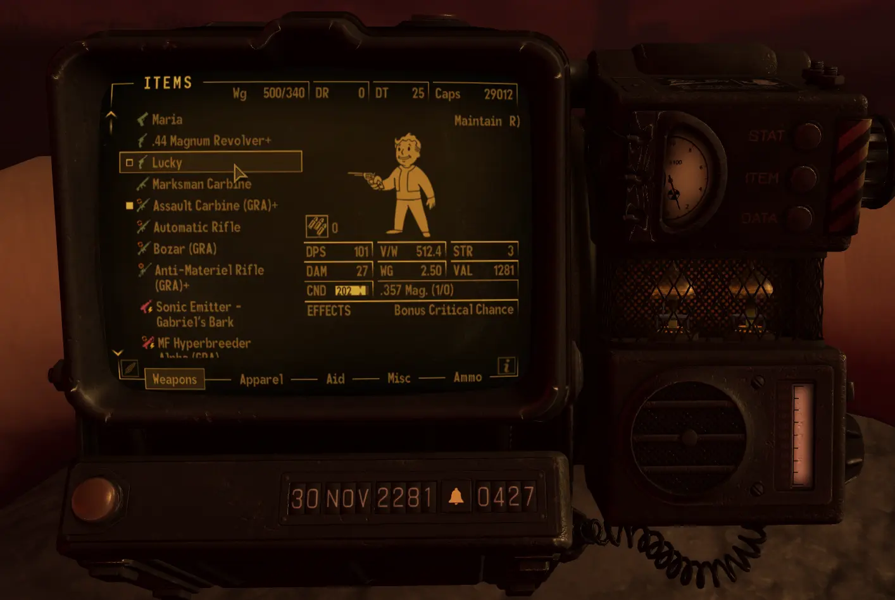
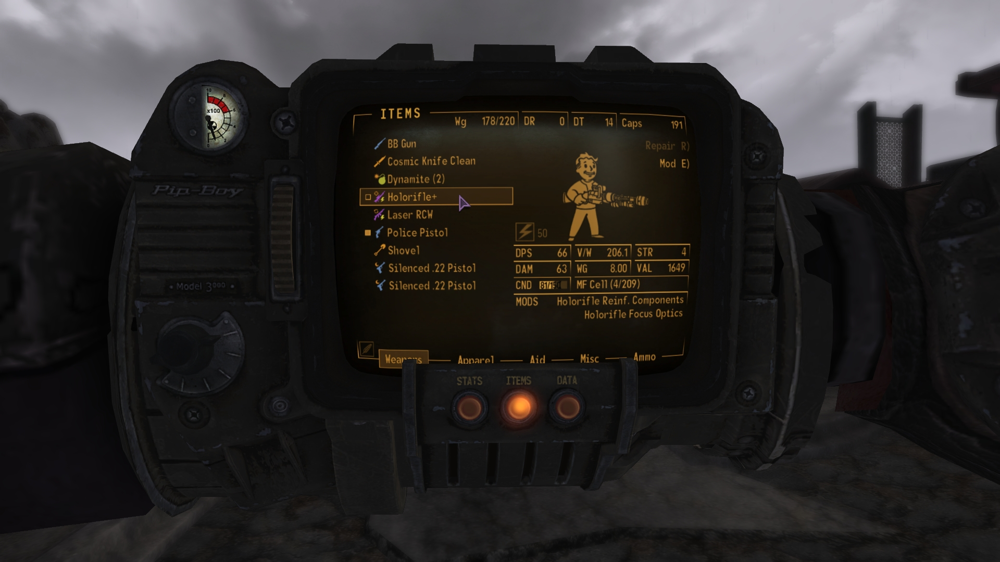
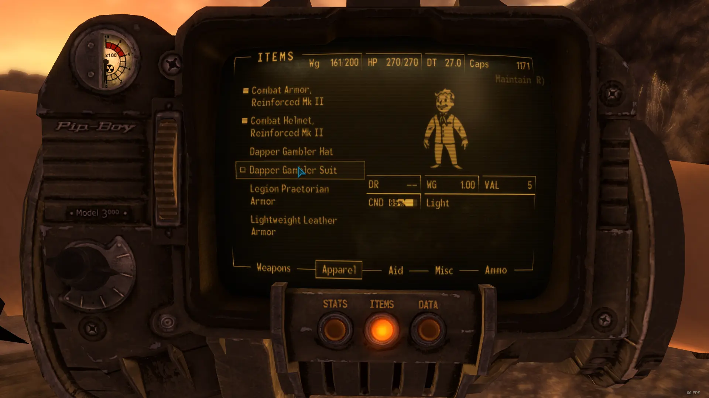
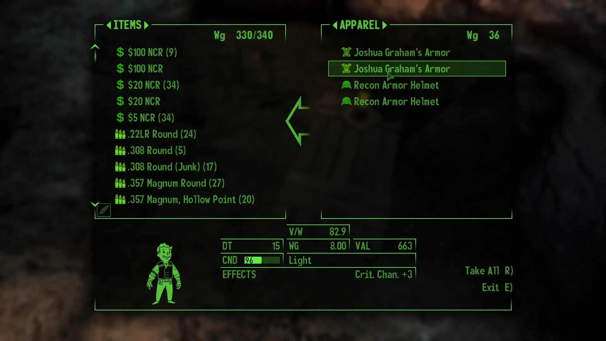

# True Condition

- [Nexus Mods](https://www.nexusmods.com/newvegas/mods/78796)

| Alternative  | Version | Upload Date  | File                                                                                                                                                                         | Notes                                                                                                                            |
| ------------ | ------- | ------------ | ---------------------------------------------------------------------------------------------------------------------------------------------------------------------------- | -------------------------------------------------------------------------------------------------------------------------------- |
|              | 1.0     | 28 Oct. 2022 | [Download](https://github.com/Starlight-Skull/game-mods/raw/refs/heads/main/Fallout%20New%20Vegas/True%20Condition/Archive/True%20Condition%20v1.0.zip)                      | Shows the actual condition/health of a weapon or armor. VUI+ and UIO required.                                                   |
| Percentage   | 1.0     | 28 Oct. 2022 | [Download](https://github.com/Starlight-Skull/game-mods/raw/refs/heads/main/Fallout%20New%20Vegas/True%20Condition/Archive/True%20Condition%20v1.0%20-%20Percentage.zip)     | Alternative file with a percentage instead of the true value. VUI+ and UIO are still required.                                   |
| Vanilla Safe | 1.0     | 28 Oct. 2022 | [Download](https://github.com/Starlight-Skull/game-mods/raw/refs/heads/main/Fallout%20New%20Vegas/True%20Condition/Archive/True%20Condition%20v1.0%20-%20Vanilla%20Safe.zip) | This is the same as the percentage version but optimized to use without VUI+. Tested and works on DarnUI. UIO is still required. |
| AIO          | 2.0     | 13 Jul. 2025 | [Download](https://github.com/Starlight-Skull/game-mods/raw/refs/heads/main/Fallout%20New%20Vegas/True%20Condition/Archive/True%20Condition%20v2.0%20-%20AIO.zip)            | All-In-One FOMOD installer. VUI+ optional.                                                                                       |

## About This Mod

> *User Interfaces - User Interface Organizer (UIO) - Quality of Life*

A small UI mod that shows the true value of your armor and weapons condition.

## Requirements

| Mod Name                                                                                          | Notes            |
| ------------------------------------------------------------------------------------------------- | ---------------- |
| [UIO - User Interface Organizer](https://www.nexusmods.com/newvegas/mods/57174)                   |                  |
| [Vanilla UI Plus (VUI+)](https://www.moddb.com/mods/vanilla-ui-plus/downloads/vanilla-ui-plus-nv) | Optional in v2.0 |

## Description

*Thanks for getting this mod on the front page of the New Vegas nexus, even if it was only for a while.*  

### 3 years later: v2.0 is out!

Update v2.0 now comes with a FOMOD installer and an optional plugin that allows all options to work without VUI+.
There is also a new option that shows the condition and max as a fraction.

This is a small mod which will display the numeric condition value of your weapon or armor.
The value is displayed on top of the CND bar in the PIP-BOY and container menus.

- UIO is a hard requirement to allow compatibility between other UI mods.
- VUI+ is recommended but optional since v2.0.

### 3 options:

- Condition
- Condition / Max Condition
- Condition%

### About VUI+

This mod's basic functionality to show the current condition value is only possible because the VUI+ plugin provides the maximum condition to the UI code. The vanilla UI only contains a percentage between 0.0 and 1.0, this can be multiplied by the CNDmax value to get an aproximation of the item's health.

For v1.0, I got around this by providing a "Vanilla Safe" version that only showed the percentage value.
For v2.0, I managed to take the code from VUI+ and make a "stripped" version that still gets the CNDmax value to the UI but nothing else.
As far as I can tell there is no other way to do this but it does make it possible to use the mod without VUI+.

VUI+ also changes the scale and positioning of the CND bar. For v2.0, I managed to get the UI code to detect this change and adapt accordingly. This means the files should scale nicely with or without VUI+.

In theory the mod should work fine with other UI overhauls but I haven't tested this. Please let me know if another mod breaks mine, I might be able to make a patch.

## Images

> 
>
> Note that this mod only changes the text over the CND bar 
>
> Alternative version with maximum 
>
> Alternative version with percent instead 
>
> Also on container menu 

## Changelogs

- Version 2.0
  - Added optional plugin
  - Updated code to work with or without VUI+
  - Added Fraction version
  - Added FOMOD installer
