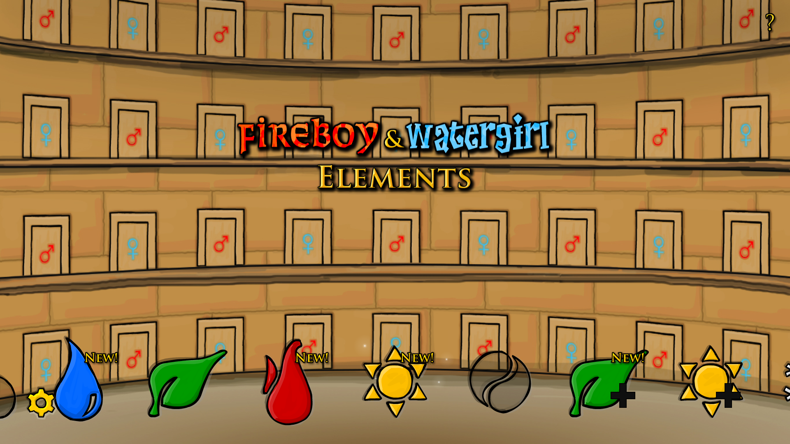

# A mod to play the other levels from this series

- [Steam Guide](https://steamcommunity.com/sharedfiles/filedetails/?id=2463060231)

| Version | Upload Date  | File                                                                                                                                                              |
| ------- | ------------ | ----------------------------------------------------------------------------------------------------------------------------------------------------------------- |
| 1.0     | 20 Apr. 2021 | [Download](https://github.com/Starlight-Skull/game-mods/raw/refs/heads/main/Fireboy%20&%20Watergirl%205/Classic%20Levels/Archive/F&W5%20-%20Classic%20Levels.zip) |

## About this mod

> *Maps or Levels - Modding or Configuration*

They're all separate games but on a technical level the files are interchangeable.

So... that's what I did.

## Description

### Quick Introduction

In total there are five of these games, each with a different theme and about 35 levels to play.

These are:

1. The Forest Temple
2. The Light Temple
3. The Ice Temple
4. The Crystal Temple
5. Elements

All of these are available online but those sites spam you with adds, can be unstable, etc, etc... At some point Elements was made available on Steam. It has a price tag but for some it's worth it if it means you can play locally.

Now for the reason this exists: only Elements is available and while it is a sort of combination of the themes of the previous games and some new ones, it doesn't have any of the previous levels. However it turns out it is fairly easy to get the old levels to run inside of Elements.

### Installation

Everything you need is neatly packed in the zip file up top. There is also an optional file to make the menu slider transparent and all icons clickable (check the screenshot).

Some basic info:

- Main files should be in:

> `C:\Program Files (x86)\Steam\steamapps\common\Fireboy & Watergirl Elements\resources\app\www`

- Progression is stored in:

> `C:\Users\<YOUR NAME>\AppData\Roaming\com.osloalbet.fb \Local Storage\leveldb`

You should back-up both of these folders before modifying anything. I included back-ups of everything I changed but I won't be held accountable in case anything goes wrong.

Progression files are not backwards compatible so if you remove this mod later you won't be able to use them anymore.

 

Everything inside "www" and "Optional Transparent Menu" needs to go in to the main file folder.

*Overwrite everything.*

There's a screenshot in case you're unsure about the optional menu.

### Extra

If you want to run the game in fullscreen you can check out my other guide:

[Fullscreen & Achievement Fix](https://steamcommunity.com/sharedfiles/filedetails/?id=2465541140)

---

