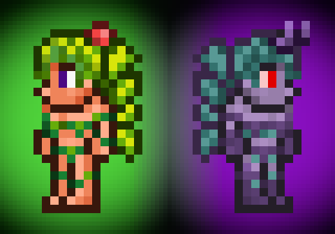

# Corrupt Dryad

- [Steam Workshop](https://steamcommunity.com/sharedfiles/filedetails/?id=2456319408)
- [Terraria Forums](https://forums.terraria.org/index.php?threads/corrupt-dryad.95932/)

| Version | Upload Date  | File |
|---------|--------------|------|
| 1.0     | 12 Jul. 2020 | [Download](https://github.com/Starlight-Skull/game-mods/raw/refs/heads/main/Terraria/Corrupt%20Dryad/Archive/Corrupt%20Dryad%20v1.0.zip) |
| 1.1     | 15 Sep. 2023 | [Download](https://github.com/Starlight-Skull/game-mods/raw/refs/heads/main/Terraria/Corrupt%20Dryad/Archive/Corrupt%20Dryad%20v1.1.zip) |

---

Inspired by the Dungeon Defenders 2 crossover.

---

In Dungeon Defenders 2's part of the crossover the dryad is a playable character and is able to change into a corrupt form.

I used the model of that game as a reference but I also took some liberties to keep the sprite from looking completely purple.

Give it a try and let me know what you think.

I don't know what else to tell you.

---

