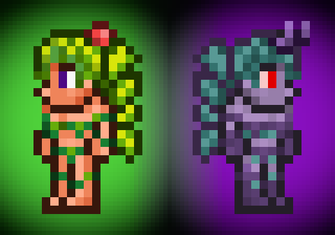

# Corrupt Dryad

| Version | File |
|---------|------|
| 1.0     | [Download](./Archive/Corrupt%20Dryad%20v1.0.zip) |

- [Steam Workshop](https://steamcommunity.com/sharedfiles/filedetails/?id=2456319408)
- [Terraria Forums](https://forums.terraria.org/index.php?threads/corrupt-dryad.95932/)

In Dungeon Defenders 2's part of the crossover the dryad is a playable character and is able to change into a corrupt form.

I used the model of that game as a reference but I also took some liberties to keep the sprite from looking completely purple.

Give it a try and let me know what you think.

I don't know what else to tell you.
