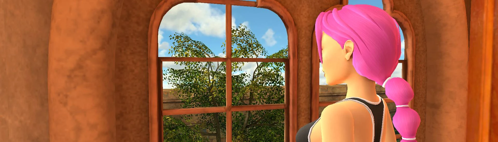

# Pink Hair

- [Nexus Mods](https://www.nexusmods.com/tombraidertrilogyremastered/mods/185)

| Version | Upload Date  | File |
|---------|--------------|------|
| 1.0     | 26 Feb. 2024 | [Download](https://github.com/Starlight-Skull/game-mods/raw/refs/heads/main/Tomb%20Raider%20I-III%20Remastered/Pink%20Hair/Archive/Pink%20Hair.zip) |

---

Simple pink hair retexture with white hairbands.

---

This is mostly the result of me experimenting with how the dds textures work but I thought others might be interested.

Just install over the game's root directory and keep a backup of the original file.

Alternatively install with the [Vortex plugin](https://www.nexusmods.com/site/mods/796).

 

For anyone interested in editing textures:

The .dds file needs to be BC7_UNORM with 6 mip map levels or it won't work.

Not all tools let you control mip maps but what worked for me is [Texconv](https://github.com/Microsoft/DirectXTex/wiki/Texconv) from Microsoft by converting the original file to .tga, editing that and converting back to .dds. That's not the easiest to use though as it is a command line tool.

---

